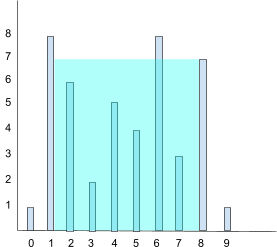

### Question

Given n non-negative integers `a1, a2, ..., an` where each represents a point at coordinate `(i, a_i)`. 'n' vertical lines are drawn such that the two endpoints of line i is at `(i, a_i)` and `(i, 0)`.
Find two lines, which together with x-axis forms a container, such that the container contains the most water.
The program should return an integer which corresponds to the maximum area of water that can be contained (maximum area instead of maximum volume sounds weird but this is the 2D plane we are working with for simplicity).

Note: You may not slant the container. 



```ruby
Example 1:
Input: height = [1, 8, 6, 2, 5, 4, 8, 3, 7, 1]
Output: 49
```

```ruby
Example 2:
Input: height = [4, 3, 2, 1, 4]
Output: 16
```

### Solution

```ruby
def max_area(numbers)
  current_max_area = 0
  for i in 0..numbers.size-1
    for j in i+1..numbers.size-1
      area = [numbers[i], numbers[j]].min * (j-1)
      current_max_area = [area, current_max_area].max
    end
  end
  current_max_area
end

puts max_area([1, 8, 6, 2, 5, 4, 8, 3, 7, 1])
```